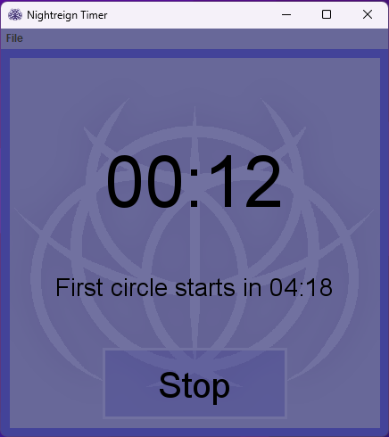
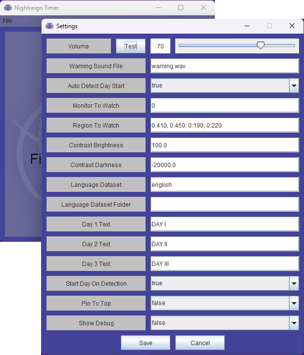

# Nightreign Timer

This program acts as a dedicated timer application for Elden _Ring: Nightreign_. It's featureset includes audio warnings for when a circle is about to close, providing information on how long you have before a circle will close, and automatic starting through image processing and detection.

Every feature is highly user configurable to match you're needed usage. See the Configuration section below.

## Technical Details

This program was built on Java 21 and will need it to run. You can get Java 21 here: https://www.oracle.com/java/technologies/javase/jdk21-archive-downloads.html

Automatic starting is handled by taking a screenshot of the center of your screen, applying a heavy amount of contrast, and then running the [JavaCPP Presets for Tesseract](https://github.com/bytedeco/javacpp-presets/tree/master/tesseract) to read the text displayed. If `DAY I` or `DAY II` are detected, the day will start. Note: If you have the map open when the `DAY X` text should be displayed, the text will be hidden by the map. Since this program relies on seeing that text, this will prevent it from automatically starting.

## Configuration

- If a warning sound should play or not. The warning sound is the summoning bell sound effect, and it plays 20 seconds before a circle will close.
- The volume of the warning sound (0-50).
- If automatic starting should be enabled or not.
    - The monitor to watch can be any numeric ID. In general, 0 represents your main monitor.
    - The region of the monitor to watch. These are not pixel numbers, but rather relative percentage based numbers. So setting x to 0.50 would start the image capture exactly in the middle (horizontally) of your screen, and setting the width to 0.25 would capture 25% of the screen width going to the right of that. The order of values is x, y, width, height. The default values are based on a 16x9 monitor.
    - Both the contrast brightness and darkness can be adjusted. The default values are fairly extreme to remove just about any color that isn't already nearly perfectly white. Making the contrast strong enough to create clear text is crucial to maximize Tesseract's ability to read it.
    - If the supplied language datasets are not adequate, you may obtain one that fits your need from the [tessdata](https://github.com/tesseract-ocr/tessdata) language dataset. In general, all languages using latin characters supported by Nightreign (as of July 2025) are included. Placing the desired language data in the `tessdata` folder will make it viewable. If you already have a `tessdata` folder somewhere, you may choose that folder in the options. Note: Not all languages are perfectly supported. Some tinkering may be needed.
    - To recognize what day the program is looking at, you may input text that should match `DAY I`, `DAY III`, and `DAY III`. Text comparison is done by reading the text on screen, removing all spaces from it, and capitalizing all letters. It then compares that text to the `DAY X` text with the same space removal and capitalization being done. In general, this improves reliability with reading text, as sometimes the text detection may output something like `iDA YI`, which would be converted into `IDAYI`. The `DAY I` filter is then also converted into `DAYI`. Since the day 1 filter is included in the final output, it can detect that as a day.
    - The automatic starting of a day when one is detected can be turned off. This is useful for debugging purposes mainly.

## Legal
This project includes the works of tesseract-ocr for [tessdata](https://github.com/tesseract-ocr/tessdata) and [JavaCPP Presets for Tesseract](https://github.com/bytedeco/javacpp-presets/tree/master/tesseract). In general, this program is open source for anyone to use and modify as they see fit under the Apache 2.0 license.